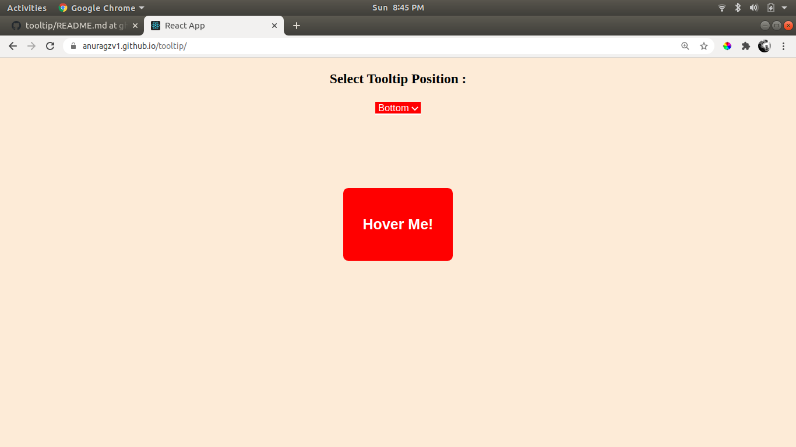

# React Tooltip
## This is a simple react Tooltip ,which takes in position [top,left,bottom,right] as a prop and displays it accordingly.
## Hosted GH-Page : https://anuragzv1.github.io/tooltip/

## How to install?

1) Clone the master-branch of this Git repo.  
2) Navigate to the folder and open terminal in it.  
3) Run command `npm install` - this will install the project on your local machine  
4) Run command `npm start` - this will open the browser and run the app  
5) In case you are stuck ? Ping me at anuragz[dot]v1[at]gmail[dot]com  

## Screenshots

## THANKYOU <3
